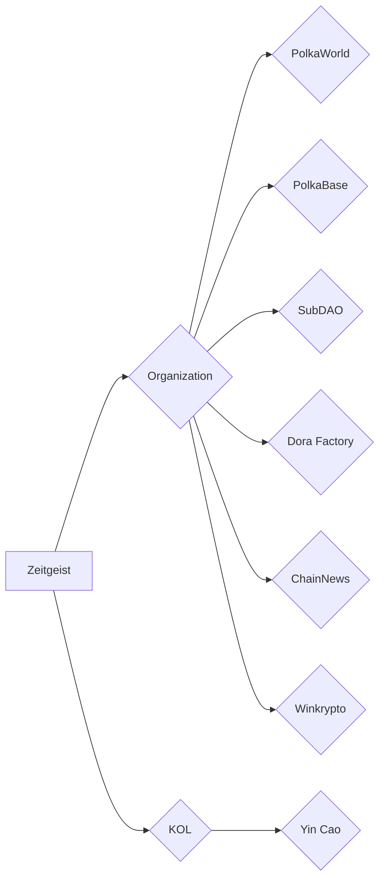

# Zeitgeist Chinese Collaboration

## Organization

### PolkaWorld

The largest Polkadot ecosystem community in China, to help the development of Polkadot ecosystem projects in China, generally, if we have more important information or activities, they will help promote it.

- Currently they will conduct an interview with us. For details, please refer to this [document](https://docs.google.com/document/d/1bRfyxZmXGe-KSle9F9LpHTR8ZHG2_6zYLbvlUypI8Rw/edit).

#### PolkaBase

This is our current media partner in China. We will pay them a service fee every month. They will help us to promote the event. Currently, we have:

- 2021.07.03 Mars Finance AMA
- 2021.07.05 JinSe Finance AMA
- A PR article

#### SubDAO

Behind it is the PAKA team. They have an organization called Polkadot DAO Alliance. Here is a simple [introduction](https://docs.google.com/document/d/1uIc5ZtVP7IvjWkd52oo2_rXxRAUCxTpATAucg8g7Uc0/edit#heading=h.5lvwhvvgpq2o). At present, our cooperation with them is about this organization. They have agreed to join us in this Polkadot DAO Alliance, but there is no clear when it will be announced. They previously said it was their next announcement.

#### Dora Factory

This team focused on the DAO field, they currently incubate internally a decentralized DAO research organization —— DAOrayaki. This organization focuses on some DAO field research, including Futarchy and prediction markets. Here are some of their [Introduction](https ://docs.google.com/document/d/1VVXLk5QHA8QKRFfmUdGWQ5ubHqbViohALV9e4wsNlTM/edit#heading=h.slelm4y9toi9).

They hope to have a cooperation with us, so that we can participate in their grant, we can conduct some research topics, here is their [cooperation proposal](https://docs.google.com/document/d/ 1Hs1Q7Lu2N6ji1sszo7mfYA1G0Ne9IEL6oSUyNk_bAVo/edit?pli=1).

#### ChainNews

One of the largest blockchain portals in China, we currently have one AMA left for our paid services.

#### Winkrypto

Another Chinese media, it was introduced by people from ChainNews. They hoped that we could participate in some of their activities, such as panels. They talked about it before, probably around September.

## KOL

### Yin Cao

He is a relatively well-known KOL in China, but he supports many projects. At the same time, he is focusing on the field of Metaverse, but he will help us propagate some of the more important activities.

